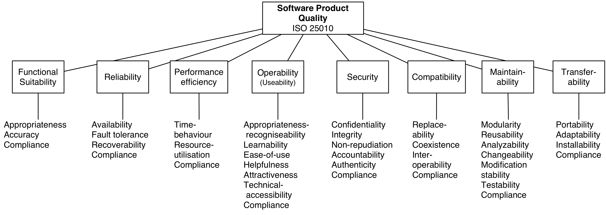

# Evaluate SaaS solutions

## Depending on the problem/solution and number of available alternatives
- do research on alternatives
- filter out obvious non-matches
- research existing customers of those alternatives, interview them to gather experiences
- request demos of remaining vendors/options
- be prepared to ask concrete questions, maybe send your questions ahead of the demo - find question candidates below
- do PoC	

## Generic Questions - excluding specific Feature match!

### SLAs, support?

### security
- authentication+authorisation integration possibilities? OAuth, Azure AD, ... ?	
- security breach disclosure policy?
- privacy policy
- in a concrete PoC validate their compliance to security standards!
- storage location+policy of secrets (passwords, api keys, certificates)

### geo-locality
- where does the solution run? where are your users? what's the latency?

### geo-balancing/-availability? 
- is there geo-balancing available to serve customers from their nearest edge nodes

### backup and recovery capabilities?

### disaster recovery?
- what if provider goes out of business? data center burns down? what's the provider's guarantees/stance in this regard?

### automatability
- - a top prio for me - if I can't provision/configure the service via API, it's a no-go. Manual processes don't go with SaaS!	

### documentation
- user documentation quality
- developer documentation quality, code examples?
- check stackoverflow+google trends for questions about the product

### pricing/model
- licensing model
- pay per use?
- payment interval

### billing automation
- is there an API to integrate with and pull billing information?

### "multi-tenancy"/multi-teams
- is it possible to isolate teams from each other, e.g. for security and billing purposes
- account management for multiple teams? is it possible to set "organisation-wide" rules/settings?

### multiple environments? 
- is it possible to (ideally automatically via API) create/destroy additional environments for development+testing

### compliance standards
- SAS70, PCI compliant for credit cards, HIPAA compliant for healthcare, TISAX automotive)

### region/zone failover? 
- is the solution hosted in multiple redundant availability zones/datacentres? physical destruction of a data centre should not impact availability

### scalability? 
- do the scalability possibilities support expected traffic increase in the next couple of years?

### strategy match
- what's the vendor's strategy? does it align with our strategy?
- check the historical development of the product - has it evolved constantly? e.g. check google trends/stackoverflow for questions about the product

### observability
- where/how to get insight into the product's performance?
- what's the metric resolution (per second/hourly/daily/...)?
- is it possible to integrate the solution's performance metrics & logs with your own systems?

### exit cost
- what happens if I want to move off the product/solution? can I get all my data?

### Inspirations for additional topics to consider in ISO 25010:

(Source: https://nocomplexity.com/overview-of-iso-25010/)

## References
- https://sandhill.com/article/how-to-evaluate-saas-vendors-five-key-considerations/
- http://www.dataqualityinstitute.com/SaaS4SMB.pdf
